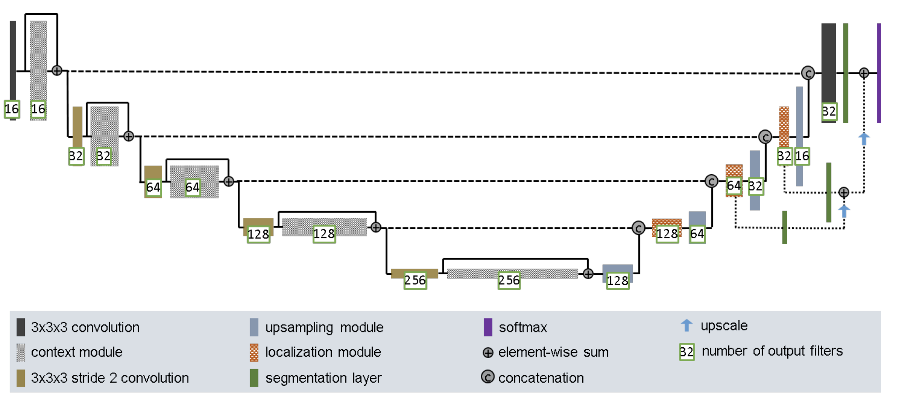
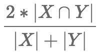
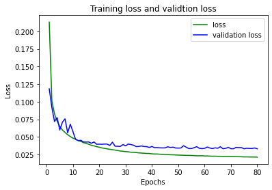

# Image Segmentation Task
Task: Segment the OASIS brain data set with an Improved UNet with all labels having a minimum Dice similarity coefficient of 0.9 on the test set.

[Data resource](https://cloudstor.aarnet.edu.au/plus/s/n5aZ4XX1WBKp6HZ): magnetic resonance (MR) image of the brain from OASIS dataset.

# Load Dataset
x_train dataset has 9664 images which are 256*256 pixels(black and white photo)

x_test dataset has 544 images which are 256*256 pixels(black and white photo)

y_train (labels) has 9664 images which are 256*256 pixels(black and white photo)

y_test (labels) has 544 images which are 256*256 pixels(black and white photo)


# Data preparation

 Using **sorted function** to sort each dataset to make sure that each picture can correspond to the corresponding label. After that, using **reshape function** to make x_train data and x_test data into 4 dimensions for instance (9664,256,256,1) and (544,256,256,1), and then divide training data and test data by 255 to achieve **normalization**. In y_train data and y_test data has 4 unique number which are 0, 85, 170 and 255, and dividing y_train data and y_test_data by 85 to make 4 labels which are 1, 2, 3 and 4.


### 4 labels which are:
* 0 - Background
* 1 - CSF (cerebrospinal fluid)
* 2 - Gray matter
* 3 - White matter

# For example:


# Unet Model

The shape of Unet network structure is similar to U like the picture above. It contains convolution and pooling layer. The left half is the encoder which is down-sampling in the traditional classification network, and the right half is the decoder is the up-sampling. The gray arrow in the middle is a jump connection, which captures the shallow features with the deep features, because the shallow layer can usually capture some simple features of the image, such as borders and colors. The deep convolution operation captures some unexplainable abstract features of the image. It is best to use the shallow and deep at the same time, while also allowing the decoder to learn to lose relevant features in the encoder pooling downsampling.

# Improved Unet

* context module: it is a pre-activation residual block with two 3X3X3 convolutional layers and a dropout layer (drop = 0.3) in between, and it is followed by 3x3x3 convolutions with input stride 2. The purpose is to allow more features while downing to the aggregation pathway and to reduce the
resolution of the feature maps. There are 5 context modules in the model.
* Upsampling modul: it is to upsampling the low-resolution feature maps and connected by a 3x3x3 convolution that halves the number of feature
maps.
*  locolization module: it contains a 3x3x3 convolution and a 1x1x1 convolution which reduces half of number of feature maps.
* Leaky ReLU: for all feature map computing convolution should use Leaky ReLU activation with a negative slope of 0.01.

References
[1] F. Isensee, P. Kickingereder, W. Wick, M. Bendszus, and K. H. Maier-Hein, “Brain Tumor Segmentation and
Radiomics Survival Prediction: Contribution to the BRATS 2017 Challenge,” Feb. 2018. [Online]. Available:
[https://arxiv.org/abs/1802.10508v1](https://arxiv.org/abs/1802.10508v1)

The biggest difference between the old model and the new model is that the new model saves a lot of time.


# Prediction results
The plot below shows the prediction results and y_test_label truth pictures on the 470th picture


# Dice_Cofficient
The Dice coefficient is a ensemble similarity measurement function, usually used to calculate the similarity of two samples, with a value range of [0,1]:



Where |X∩Y| is the intersection between X and Y, and |X| and |Y| sub-tables represent the number of elements of X and Y. Among them, the coefficient of the numerator is 2, because the denominator has repeated calculations of X and Reasons for common elements among Y.
# Dice Loss
Dice loss = 1 - dice_coefficient

The use of Dice Loss and the sample are extremely unbalanced. If Dice Loss is used under normal circumstances, it will have an adverse effect on back propagation and make training unstable.

Because the background color 0 accounts for more than 80%. It is a severely unbalanced data. So we need to use dice coefficient to evaluate the model.

# The result

dice_coefficient: 0.9681 which achieves our goal and the performance is good.

Using command below to save the best result
```python
model_checkpoint_callback = tf.keras.callbacks.ModelCheckpoint(
    filepath=checkpoint_path,
    save_weights_only=True,
    monitor='val_loss',
    mode='min',
    save_best_only=True)
```

Each label's dice coefficient score from 0 to 3:
[0.9987185 , 0.94281095, 0.95675904, 0.9739685 ]



When the epoch increases, the distance between training loss and val_loss also increases, which means that the model will overfitting after keep training.

The plot below shows how dice_coefficient changes during training


